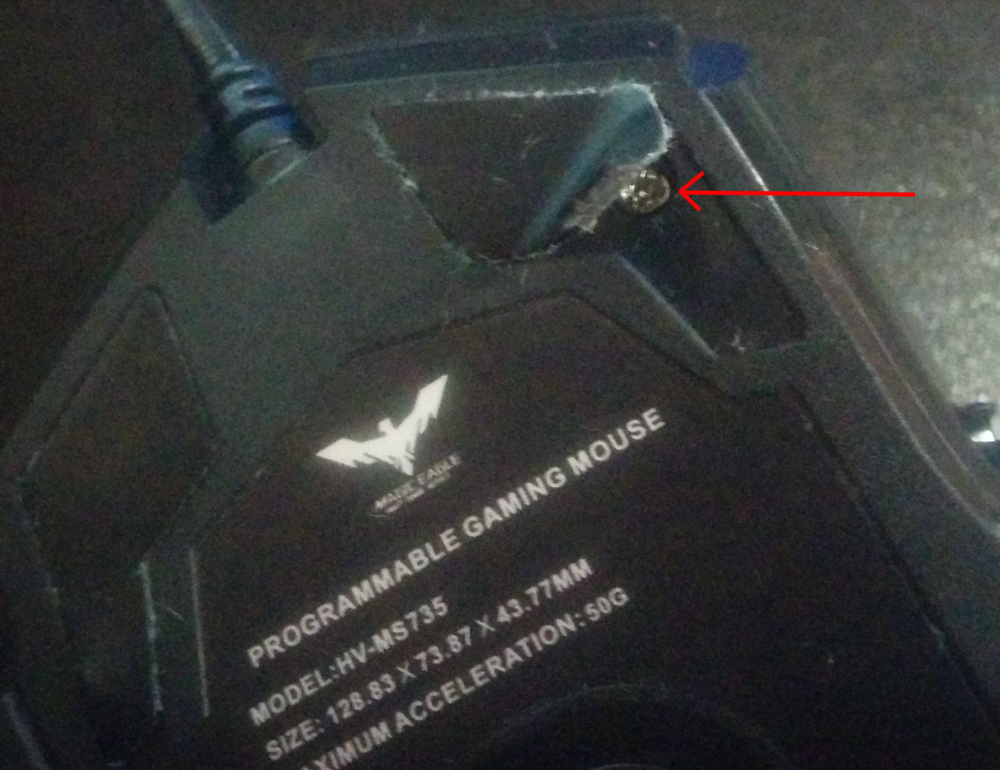
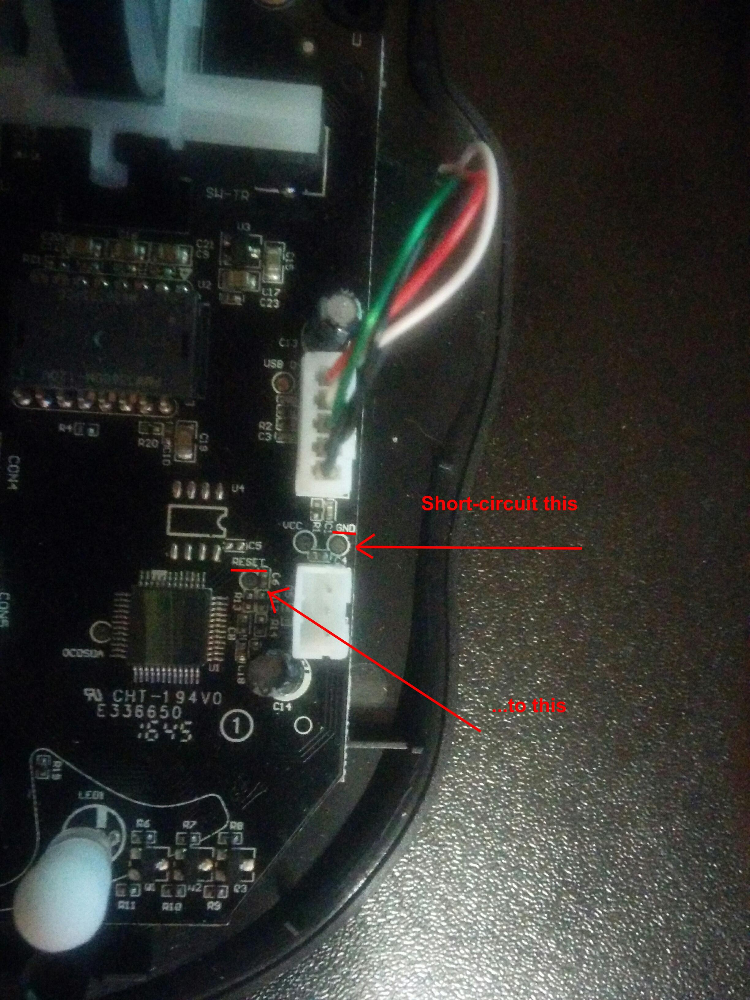

# How to unbrick the device

So, your device no longer works. Buttons are ok, but the cursor does not
move across the screen. Or even worse. The side buttons are Illuminated
and nothing else. You've broke it. Fortunately, there are several ways
to reanimate the device.

Download the drivers from the manufacturer's website:
[http://www.havit.hk/downloads/]
install and locate the program named 'FwUpdate.exe'. In my system it was
in the folder "C:\Program Files\HV-MS735\Update\X64". Yes, you need a
copy of MS Windows for this task. Run the program and press the "Update"
button.If it responds with "Please insert the mouse and try again", while
the device is definitely plugged in, then you have to unbrick it first.

## Soft method

Start the program with --unbrick command line parameter:

    ./hv-ms735-config --unbrick

then try to plug'n'unplug the device. The device will be turned off
and reappears as 04d9:8022. Then use the firmware update utility.

## Hard method

If the soft method does not work, then you have to disassemble the device
and forget about the warranty. First, unscrew the screws (four total):

Then disassembly the device and plug it to the your host.

When the device will be powered on, short-circuit the "Reset" connector
to the "Ground" connector:

The device will be turned off and reappears as 04d9:8022. It is the time
to run FwUpdate.exe.

## If nothing helps

Congratulations! You dids something like that, which I never thought of
(and I'm tried very, very hard). Please find the solution by yourself
and be sure **to share** the solution with me, to help other people who
are in a similar situation. Good luck!
